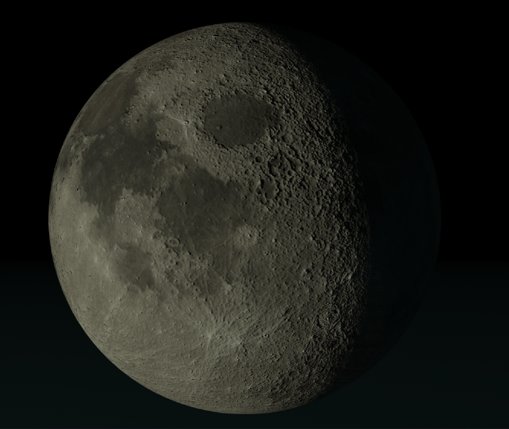
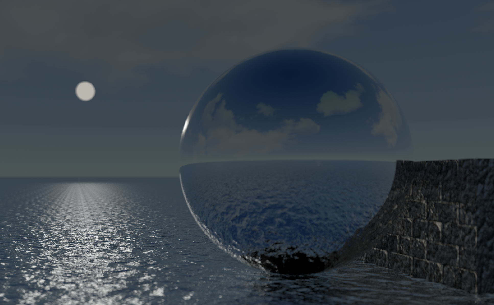
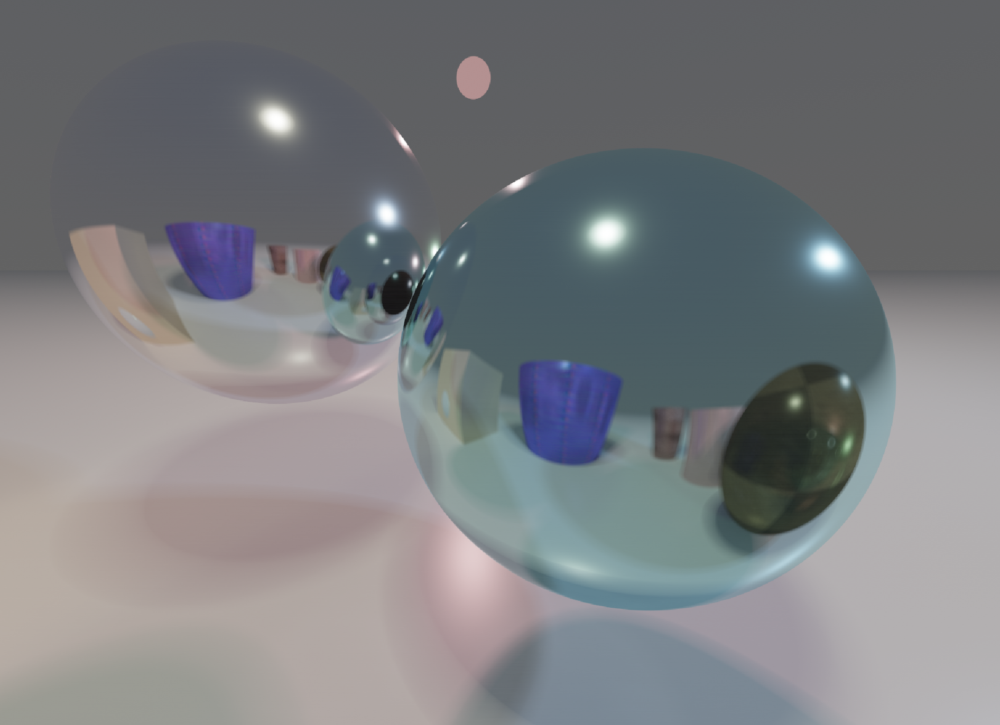
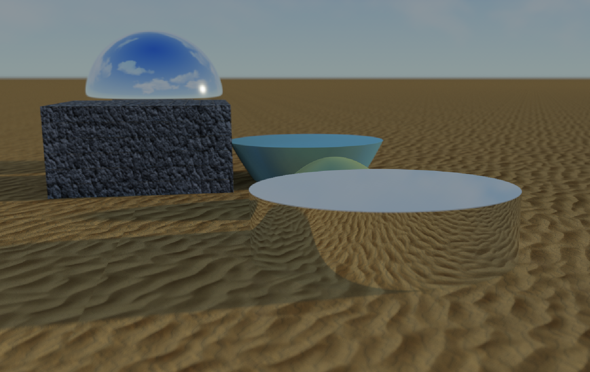

# miniRT: 2000 lines of code can make something cool

## 📸 Gallery

  
*A textured moon sphere with bump mapping and soft lighting. (Scene: moon.rt)*

  
*A long corridor filled with cylinders and spheres, showcasing shadows and depth. (Scene: hall.rt)*

  
*Paraboloids, boxes, and spheres in a sandy environment with textures. (Scene: desert.rt)*

  
*Blocky voxel-style scene with a tree, chest, and cactus on islands. (Scene: minecraft.rt)*

  
*Ocean view with waves, skybox, and various objects. (Scene: sea.rt)*

  
*Chess pieces on a checkerboard plane with colored lights. (Scene: checkers.rt)*

  
*Ultimate scene with PBR materials, multiple lights, textures, bump maps, and depth of field. (Scene: colors.rt)*

  
*Mixed objects with skybox, reflections, and advanced lighting. (Scene: std.rt)*

## 🚀 Intro

Hey there! <please add introduction or remove it completely

### Key Highlights
- **Photorealistic Rendering**: 
- **Performance Optimized**: Multi-threaded tile-based rendering with progressive refinement, achieving smooth real-time updates.
- **Interactive Editing**: Manipulate objects in 3D space with mouse controls during rendering—no restarts needed!
- **Advanced Effects**: Depth of field, soft shadows, reflections, and texture mapping for cinematic results.
- **Robust Architecture**: Clean, modular C code with custom math libraries and comprehensive error handling.

## 🛠️ Technical Details

### Core Technologies
- **Language**: Pure C, Norm-compliant, no leaks, full error handling.
- **Graphics**: MLX42, minimal graphic library from codam.
- **Math Libraries**: Custom vector algebra, quaternion operations, and geometric utilities.
- **Concurrency**: POSIX threads to make rendering fly on multi-core CPUs.
- <scaling description placeholder>

### Advanced Features
- **Physically-Based Rendering (PBR)**: Realistic lighting with Fresnel, GGX distribution, and geometry terms.
- **Path Tracing**: Monte Carlo integration for global illumination, reflections, and ambient occlusion.
- **Quaternion Rotations**: Smooth transformations using custom quaternion math.
- **Texture Mapping**: Bilinear-filtered PNG support with normal mapping for surface details.
- **Anti-Aliasing & DoF**: Random sampling for camera effects and noise reduction.
- **Real-Time Editing**: Mouse-based object manipulation with intuitive controls.
- **Multi-Threading**: Scalable parallel processing with job queues and synchronization.

### Code Quality
Modular design with clear separation of concerns (parsing, rendering, math). Extensive validation, optimized algorithms, and memory-safe operations.

## 🎮 Controls

- **Movement**: W/A/S/D to move forward/left/back/right, Space/Shift for up/down.
- **Object Selection**: Left-click on an object to select it.
- **Editing Modes**: Hold Z + click to translate, X + click to rotate, C + click to scale.
- **Quit**: ESC to exit.
- **Dump Scene**: F5 to save the current scene to a file.

## 📄 Scene File Format

Scenes are defined in .rt files with the following elements:

- **Ambient Light**: `A ratio R,G,B [secondary_R,G,B] [texture]`
- **Camera**: `C pos_x,y,z dir_x,y,z fov [focus_depth] [aperture]`
- **Light**: `L pos_x,y,z brightness R,G,B [radius]`
- **Sphere**: `sp pos_x,y,z radius R,G,B [rough] [metallic] [texture] [bump]`
- **Plane**: `pl pos_x,y,z normal_x,y,z R,G,B [rough] [metallic] [texture] [bump]`
- **Cylinder**: `cy pos_x,y,z normal_x,y,z radius height R,G,B [rough] [metallic] [texture] [bump]`
- **Paraboloid**: `pa pos_x,y,z normal_x,y,z radius height R,G,B [rough] [metallic] [texture] [bump]`
- **Box**: `bx pos_x,y,z normal_x,y,z size_x,y,z R,G,B [rough] [metallic] [texture] [bump]`

All values are floats, colors in 0-255 range, positions/normals in world coordinates.

## 🏗️ Supported Objects

- **Spheres**: Perfect for balls, planets, or simple shapes.
- **Planes**: Infinite surfaces like floors or walls.
- **Cylinders**: Tubes, pillars, or rounded columns.
- **Paraboloids**: Cone-like shapes for advanced geometry.
- **Boxes**: Cuboids for buildings, crates, or voxel-style objects.

## 📦 Getting Started

Ready to try it?

1. **Build it**:
   ```bash
   make
   ```

2. **Run a scene**:
   ```bash
   ./miniRT maps/std.rt
   ```

3. **Play around**: Load different .rt files from `maps/` and edit scenes live!

## 👥 Team Responsibilities

- **[oliynykmax](https://github.com/oliynykmax)**: Handled all the parsing, validation, and file stuff—keeping data solid.
- **[datagore](https://github.com/datagore)**: Focused on the rendering core, math libs, and making it fast.

## 🏗️ Architecture Overview

- **Vector Math**: Custom 3D ops for quick calculations.
- **Scene Parser**: Reads and validates .rt files.
- **Ray Tracing Core**: Handles intersections, shading, and path tracing.
- **Object Library**: Spheres, planes, cylinders, paraboloids, boxes.
- **Rendering Pipeline**: Multi-threaded tiles that refine over time.

---

*Let's render some magic!* ✨
